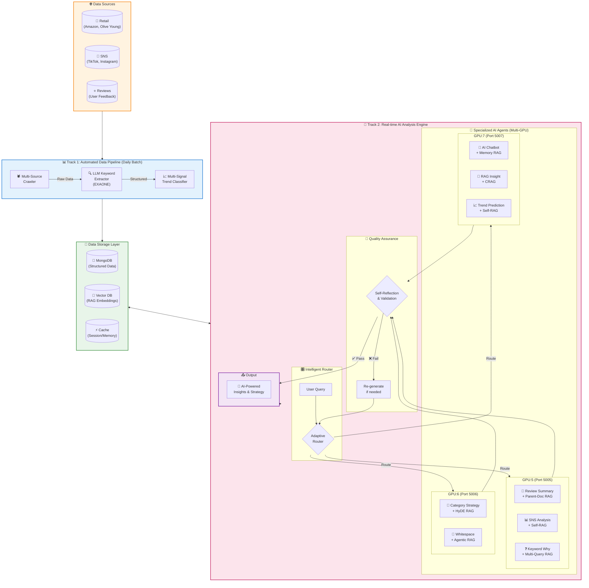
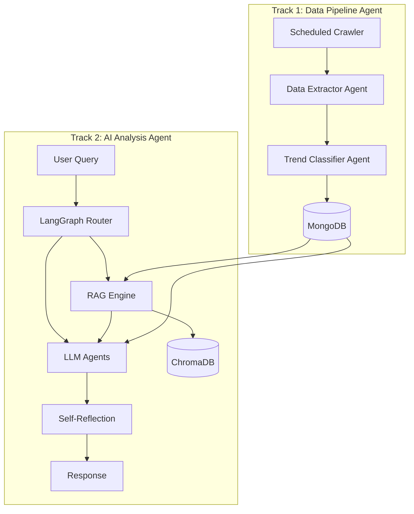
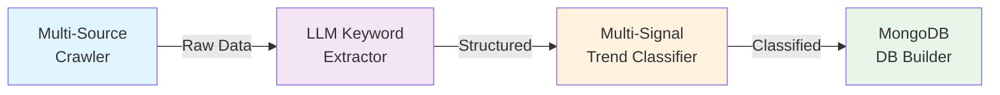
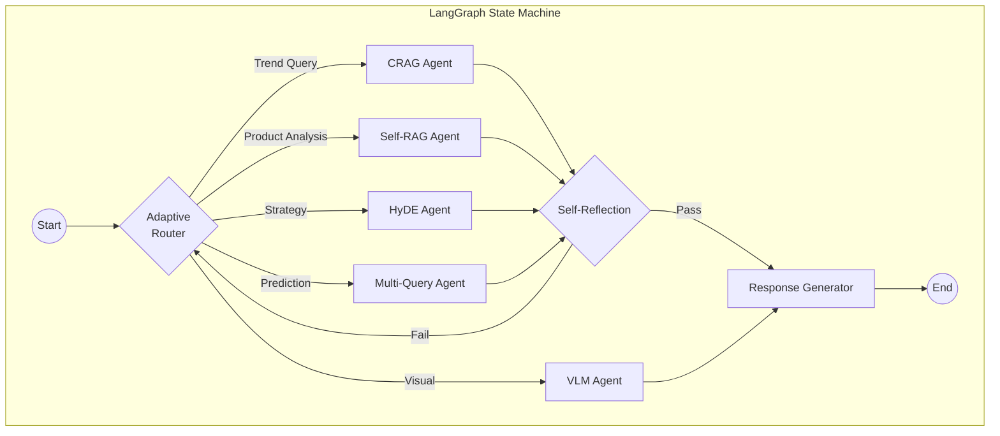
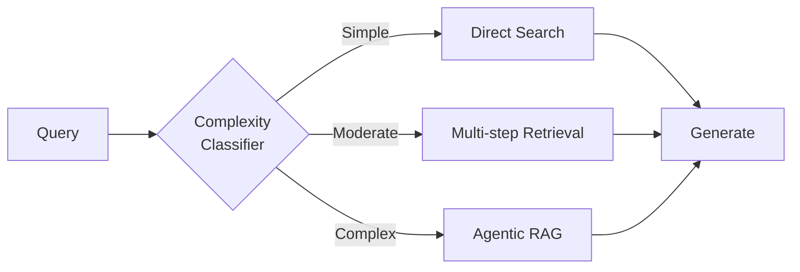
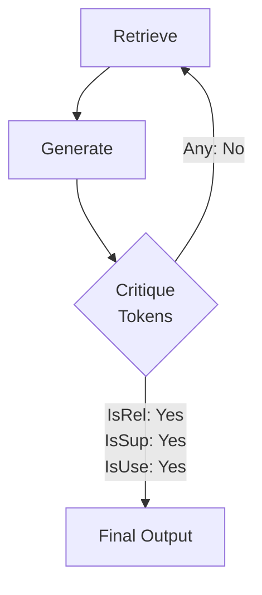
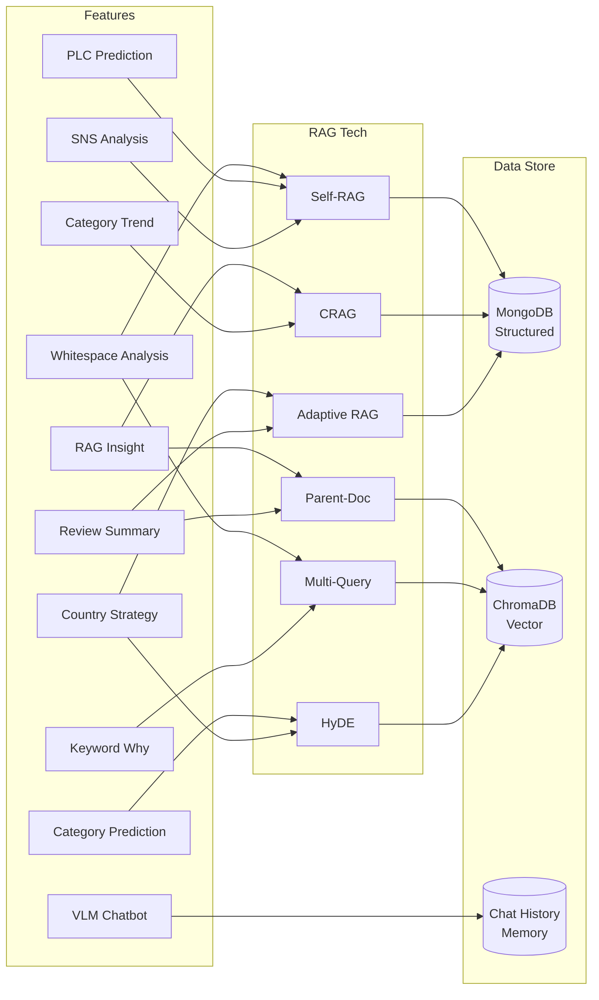

<p align="center">
  
</p>

<h1 align="center">AMORE CLUE</h1>
<h3 align="center">Cosmetic Landscape & Utility Engine</h3>

<p align="center">
  <strong>Two-Track Multi-Agent AI System for Global Beauty Trend Intelligence</strong>
</p>

<p align="center">
  
  
  
  
  
</p>

---

## 🎯 System Architecture Overview

<p align="center">
  <strong>Two-Track Multi-Agent AI System with Advanced RAG Pipeline</strong>
</p>



### 🔬 RAG Technology Mapping

| Track | Feature | RAG Technique | Description |
|:-----:|---------|:-------------:|-------------|
| **Track 1** | Data Extraction | **LLM-based NER** | 제품명, 성분, 효능 키워드 자동 추출 |
| **Track 1** | Trend Classification | **Multi-Signal Fusion** | SNS + Retail + Review 신호 통합 분류 |
| **Track 2** | Review Summary | **Parent-Document RAG** | 개별 리뷰 검색 → 전체 문서 컨텍스트 활용 |
| **Track 2** | SNS Analysis | **Self-RAG** | 생성 결과 자체 평가 및 재생성 |
| **Track 2** | Keyword Why | **Multi-Query RAG** | 쿼리를 4방향 분해 후 RRF 통합 |
| **Track 2** | Category Strategy | **HyDE** | 가상 문서 생성 → 유사 전략 검색 |
| **Track 2** | Whitespace | **Agentic RAG** | 다단계 추론 기반 시장 기회 탐색 |
| **Track 2** | RAG Insight | **CRAG** | 검색 품질 평가 → 외부 소스 보정 |
| **Track 2** | AI Chatbot | **Memory RAG** | 대화 이력 기반 컨텍스트 유지 |
| **Track 2** | Trend Prediction | **Adaptive RAG** | 쿼리 복잡도 기반 전략 동적 선택 |

---

## Overview

AMORE CLUE는 글로벌 뷰티 시장의 트렌드를 **수집 - 분석 - 예측**하는 Two-Track Multi-Agent AI 시스템입니다.

**Track 1**은 매일 자동으로 데이터를 크롤링하고 트렌드를 분류하며, **Track 2**는 LangGraph 기반 AI Agent들이 실시간으로 인사이트를 생성합니다.

```
┌─────────────────────────────────────────────────────────────────────┐
│                        AMORE CLUE System                            │
├────────────────────────────┬────────────────────────────────────────┤
│    Track 1: Data Pipeline  │     Track 2: AI Analysis Engine        │
│    (Daily Batch Agent)     │     (Real-time LangGraph Agents)       │
│                            │                                        │
│  Crawling → Extraction     │   Query → Routing → RAG → Generation  │
│  → Classification → DB    │   → Reflection → Response              │
└────────────────────────────┴────────────────────────────────────────┘
```

---

## Architecture

### Two-Track Agent Flow



---

## Track 1: Data Pipeline Agent Flow

하루 단위로 실행되는 자동화된 데이터 수집 및 트렌드 분류 파이프라인입니다.

### Pipeline Stages



| Stage | Agent | Input | Output | DB Collection |
|-------|-------|-------|--------|---------------|
| 1. Crawling | `Scheduler Agent` | Target URLs (Retail, SNS, Review) | Raw HTML/JSON | `raw_retail_sales`, `raw_reviews`, `raw_sns_posts` |
| 2. Extraction | `Keyword Extractor` | Product descriptions | Ingredient, Formula, Effect, Mood | `keyword_extractions` |
| 3. Classification | `Trend Classifier` | Multi-signal scores | Early / Growing / Actionable | `trend_classifications` |
| 4. DB Build | `Aggregation Agent` | Classified trends | Leaderboard, Combinations | `leaderboard`, `combinations` |

### Trend Classification Logic

다요소 점수 기반 하이브리드 분류 시스템:

```
Signal Sources (3):
├── SNS: Instagram, TikTok, YouTube mention volume & growth
├── Retail: Amazon, Olive Young sales rank & velocity
└── Review: Rating, sentiment, keyword frequency

Classification Thresholds:
├── Early Trend:      Growth ≥ 30% | Persistence ≥ 2weeks | Signal Consistency ≥ 0.3
├── Growing Trend:    Growth ≥ 10% | Persistence ≥ 4weeks | Signal Consistency ≥ 0.6
└── Actionable Trend: Growth ≥ 5%  | Persistence ≥ 6weeks | Signal Consistency ≥ 0.8
```

### Data Sources & Collections

```
MongoDB (Structured Data)
├── raw_retail_sales      : 리테일 판매 순위 원본 데이터
├── raw_reviews           : 제품 리뷰 원본 데이터
├── raw_sns_posts         : SNS 언급량 원본 데이터
├── keyword_extractions   : LLM 추출 키워드 (성분/제형/효과/무드)
├── trend_classifications : 트렌드 분류 결과
├── leaderboard           : 국가별/카테고리별 리더보드
├── combinations          : 성분+제형 조합 분석 결과
├── sns_platform_stats    : 플랫폼별 SNS 통계
└── batch_job_logs        : 배치 작업 이력
```

---

## Track 2: AI Analysis Agent Flow

LangGraph 기반 Multi-Agent 시스템이 실시간으로 사용자 쿼리를 분석하고, 최신 RAG 기술을 적용하여 인사이트를 생성합니다.

### LangGraph Agent Orchestration



### GPU Distribution & Features

3개 GPU에 분산 배치된 AI Agent들 (EXAONE-3.5-7.8B-Instruct):

```
┌─────────────────────────────────────────────────────────────────────────────┐
│                         GPU Cluster (3x A6000 GPUs)                         │
├─────────────────────────┬─────────────────────────┬─────────────────────────┤
│   GPU 5 (Port 5005)     │   GPU 6 (Port 5006)     │   GPU 7 (Port 5007)     │
│   EXAONE-3.5-7.8B       │   EXAONE-3.5-7.8B       │   EXAONE-3.5-7.8B       │
│   ~17GB VRAM            │   ~17GB VRAM            │   ~17GB VRAM            │
├─────────────────────────┼─────────────────────────┼─────────────────────────┤
│ • SNS Analysis          │ • Category Strategy     │ • AI Chatbot (RAG)      │
│   + Self-RAG            │   + HyDE RAG            │   + Memory RAG          │
│ • Whitespace Product    │ • Whitespace Category   │ • Review Summary        │
│   + Agentic RAG         │   + Multi-Query RAG     │   + Parent-Doc RAG      │
│ • Keyword Why           │                         │ • RAG Insight           │
│   + Multi-Query RAG     │                         │   + CRAG                │
│                         │                         │ • Category Trend        │
│                         │                         │ • PLC Prediction        │
└─────────────────────────┴─────────────────────────┴─────────────────────────┘
```

### Advanced RAG Techniques

각 기능에 최적화된 최신 RAG 기술을 적용합니다:

#### 1. Adaptive RAG (Router-based)

쿼리 복잡도에 따라 최적의 검색 전략을 동적으로 선택합니다.



| 적용 기능 | 전략 | 설명 |
|-----------|------|------|
| Review Summary | Direct Search | 리뷰 데이터 직접 검색 후 요약 |
| Keyword Why | Multi-step | 키워드 → 관련 트렌드 → 원인 분석 |
| Country Strategy | Agentic | 다국가 데이터 비교 분석 후 전략 도출 |

#### 2. Corrective RAG (CRAG)

검색된 문서의 관련성을 평가하고, 부적절할 경우 웹 검색으로 보정합니다.

```
┌─────────┐     ┌──────────┐     ┌────────────┐
│ Retrieve │ ──▶ │ Evaluate │ ──▶ │  Relevant? │
└─────────┘     └──────────┘     └────────────┘
                                    │Yes    │No
                                    ▼       ▼
                              ┌────────┐ ┌──────────┐
                              │Generate│ │Web Search│
                              └────────┘ │+ Refine  │
                                         └──────────┘
```

| 적용 기능 | Data Source | Fallback |
|-----------|------------|----------|
| Category Trend | `trend_classifications` + ChromaDB | SNS 실시간 데이터 보정 |
| RAG Insight | `combinations` + Vector DB | 외부 뷰티 트렌드 리포트 |

#### 3. Self-RAG (Self-Reflective)

생성된 응답의 품질을 스스로 평가하고, 기준 미달 시 재생성합니다.



| 적용 기능 | 평가 기준 | Reflection 조건 |
|-----------|----------|----------------|
| SNS Analysis | Factual grounding | 데이터 수치와 불일치 시 재생성 |
| PLC Prediction | Logical consistency | 시계열 논리 오류 시 재생성 |
| Whitespace Product | Market feasibility | 비현실적 제안 시 재생성 |

#### 4. HyDE (Hypothetical Document Embeddings)

쿼리로부터 가상 문서를 생성한 뒤, 해당 임베딩으로 유사 문서를 검색합니다.

```
Query: "2024년 미백 트렌드 성분은?"
         │
         ▼
┌─────────────────────────────┐
│ LLM generates hypothetical  │
│ document about whitening     │
│ trend ingredients 2024...    │
└─────────────────────────────┘
         │ embed
         ▼
┌─────────────────────────────┐
│ Vector Search with HyDE      │
│ embedding → Better recall    │
└─────────────────────────────┘
```

| 적용 기능 | 장점 | Vector DB |
|-----------|------|-----------|
| Category Strategy | 추상적 전략 쿼리의 검색 정확도 향상 | ChromaDB |
| Category Prediction | 미래 트렌드 예측을 위한 유사 과거 패턴 검색 | ChromaDB |

#### 5. Multi-Query RAG

하나의 쿼리를 여러 관점으로 분해하여 검색 커버리지를 극대화합니다.

```
Original Query: "레티놀 성분이 왜 인기인가?"
         │
         ├── Sub-Query 1: "레티놀 효과 리뷰 분석"
         ├── Sub-Query 2: "레티놀 SNS 언급량 추이"
         ├── Sub-Query 3: "레티놀 포함 제품 판매 순위"
         └── Sub-Query 4: "레티놀 관련 성분 트렌드"
                    │
                    ▼ Reciprocal Rank Fusion
              ┌──────────┐
              │ Merged    │
              │ Context   │
              └──────────┘
```

| 적용 기능 | Sub-Query 전략 | Fusion 방식 |
|-----------|---------------|-------------|
| Keyword Why | 효과/리뷰/SNS/판매 4방향 분해 | Reciprocal Rank Fusion |
| Whitespace Category | 경쟁/수요/공급/트렌드 분해 | Weighted Score Fusion |

#### 6. Parent-Document Retrieval

세분화된 chunk로 검색하되, 응답 생성 시에는 상위 문서 전체를 컨텍스트로 활용합니다.

```
Document Store:
├── Parent: 전체 제품 리뷰 보고서 (2000 tokens)
│   ├── Child Chunk 1: 성분 분석 (200 tokens) ← Search hit
│   ├── Child Chunk 2: 사용감 리뷰 (200 tokens)
│   └── Child Chunk 3: 가격 비교 (200 tokens)
│
└── Retrieved Context: Parent 전체 (2000 tokens) → Richer generation
```

| 적용 기능 | Parent 단위 | Child 단위 |
|-----------|------------|------------|
| Review Summary | 제품별 리뷰 전체 | 개별 리뷰 문장 |
| RAG Insight | 카테고리별 트렌드 리포트 | 키워드별 통계 |

---

### Feature - RAG - DB Mapping

각 AI 기능이 어떤 RAG 기술과 데이터를 사용하는지 한눈에 보여줍니다:



---

## Tech Stack

| Layer | Technology | Purpose |
|-------|-----------|---------|
| Frontend | React 18 + TypeScript + Tailwind CSS | Dashboard UI |
| Build | Vite 5 | Fast HMR & Build |
| Backend | Node.js + Express | API Gateway & Proxy |
| AI Orchestration | Multi-Agent System | GPU-distributed Workflow |
| LLM | EXAONE-3.5-7.8B-Instruct (x3 GPU) | Text Generation (17GB each) |
| RAG | Sentence-Transformers + NumPy | 150 Marketing Cases Vector Search |
| Embedding | paraphrase-multilingual-MiniLM-L12-v2 | 384D Multilingual Embeddings |
| Database | MongoDB | Persistent Storage |
| Hosting | Firebase Hosting | Frontend CDN |
| Tunnel | Cloudflare Tunnel | GPU Server Exposure |
| GPU | NVIDIA RTX A6000 (x3) | 49GB VRAM each |

---

## Project Structure

```
amore_ver2/
├── src/                          # Frontend (React + TypeScript)
│   ├── components/               # 25+ React components
│   │   ├── ChatBot.tsx           # AI 챗봇 (드래그 & 확장 가능)
│   │   ├── SegmentedLeaderboard.tsx  # 트렌드 리더보드
│   │   ├── KeywordAIAnalysis.tsx # 키워드 AI 분석
│   │   ├── TrendInsightDashboard.tsx # RAG 인사이트 대시보드
│   │   └── ...                   # 기타 컴포넌트
│   ├── services/api.ts           # API client (LLM 프록시)
│   ├── data/                     # 데이터 타입 & 유틸리티
│   └── App.tsx                   # Main application
│
├── server/                       # Backend
│   ├── index.js                  # Express API gateway + CORS
│   ├── routes/                   # API endpoints
│   │   └── realData.js           # MongoDB 연동 API
│   ├── rag_data/                 # RAG 임베딩 데이터
│   │   └── rag_embeddings.json   # 150개 마케팅 사례 벡터
│   ├── data_for_rag/             # RAG 원본 데이터 (Excel)
│   ├── scripts/                  # DB & RAG 유틸리티
│   │   └── build_rag_embeddings.py  # RAG 임베딩 생성기
│   ├── llm_server_port5.py       # GPU5: SNS, Whitespace, Keyword
│   ├── llm_server_port6.py       # GPU6: Strategy, Whitespace Category
│   └── llm_server_port7.py       # GPU7: Chat, Review, RAG Insight
│
├── .env.production               # Frontend env (Cloudflare Tunnel URL)
├── firebase.json                 # Firebase hosting config
└── package.json                  # Frontend dependencies
```

---

## Getting Started

### Prerequisites

- Node.js 20+
- Python 3.10+ with CUDA support
- MongoDB Atlas account
- 4x GPU (VRAM 16GB+ each)

### 1. Frontend Setup

```bash
npm install
npm run dev              # Development server
npx vite build           # Production build
npx firebase deploy --only hosting
```

### 2. Backend Setup

```bash
cd server
npm install
pip install -r requirements.txt

# Start API server
node index.js

# Start GPU LLM servers (3 separate terminals)
# Conda environment: amore_clue
source ~/anaconda3/bin/activate amore_clue

python llm_server_port5.py  # GPU5 - EXAONE (SNS, Whitespace, Keyword)
python llm_server_port6.py  # GPU6 - EXAONE (Strategy, Whitespace Category)
python llm_server_port7.py  # GPU7 - EXAONE (Chat, Review, RAG Insight)
```

### 3. Tunnel Setup (for external access)

```bash
# Cloudflare Tunnel (HTTP/2)
cloudflared tunnel --url http://localhost:5000 --protocol http2
```

### 4. Environment Variables

```env
# server/.env
GEMINI_API_KEY=your_gemini_api_key
MONGODB_URI=mongodb+srv://your_connection_string
MONGODB_DATABASE=amore
PORT=5000
```

---

## API Endpoints

| Method | Endpoint | GPU (Port) | RAG Tech | Description |
|--------|----------|------------|----------|-------------|
| POST | `/api/llm/sns-analysis` | GPU5 (5005) | Self-RAG | SNS 트렌드 분석 |
| POST | `/api/llm/keyword-why` | GPU5 (5005) | Multi-Query | 키워드 인기 원인 분석 |
| POST | `/api/llm/whitespace-product` | GPU5 (5005) | Agentic | 화이트스페이스 제품 발굴 |
| POST | `/api/llm/category-strategy` | GPU6 (5006) | HyDE | 카테고리 전략 수립 |
| POST | `/api/llm/whitespace-category` | GPU6 (5006) | Multi-Query | 카테고리 갭 분석 |
| POST | `/api/chat/text` | GPU7 (5007) | Memory | AI 챗봇 (텍스트) |
| POST | `/api/chat/multimodal` | GPU7 (5007) | Memory | AI 챗봇 (이미지+텍스트) |
| POST | `/api/llm/review-summary` | GPU7 (5007) | Parent-Doc | 리뷰 요약 & 감성 분석 |
| POST | `/api/llm/category-trend` | GPU7 (5007) | Adaptive | 카테고리 트렌드 예측 |
| POST | `/api/llm/rag-insight` | GPU7 (5007) | CRAG | RAG 기반 심층 인사이트 |
| POST | `/api/llm/plc-prediction` | GPU7 (5007) | Self-RAG | 제품 수명주기 예측 |
| POST | `/api/llm/category-prediction` | GPU7 (5007) | HyDE | 카테고리 성장 예측 |
| POST | `/api/workflow/run` | Cloud | - | LangGraph 배치 워크플로우 |

---

## License

This project is proprietary software developed for AMOREPACIFIC Corporation.
