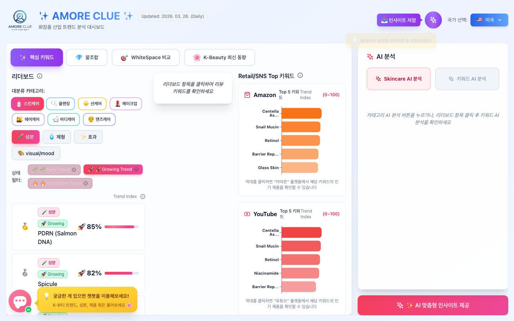
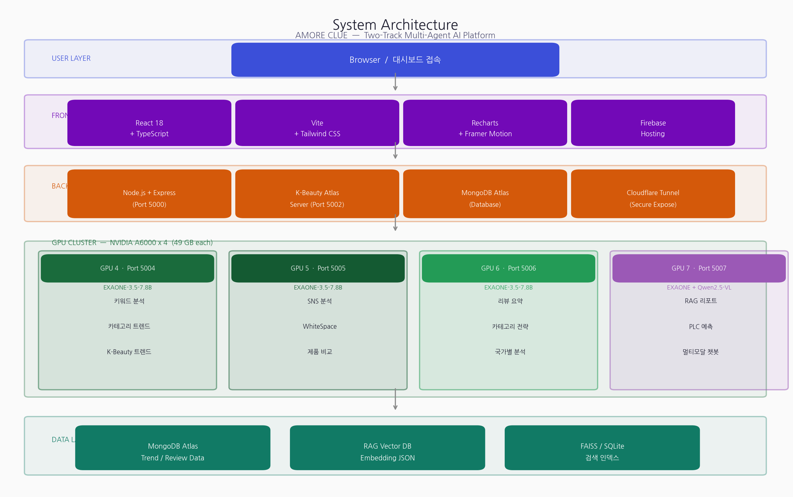
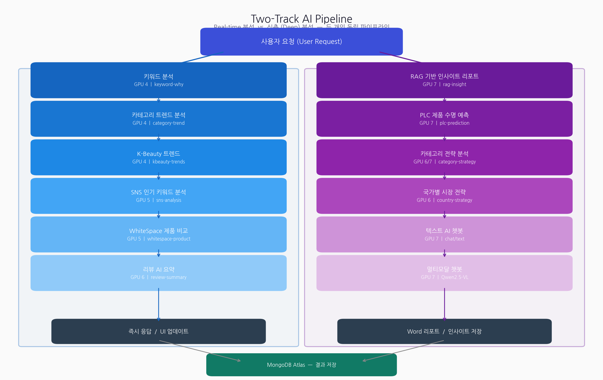
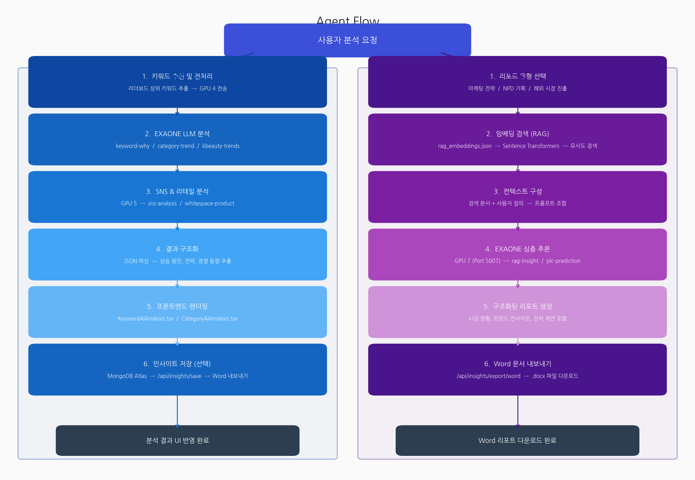

<p align="center">
  
</p>

<h1 align="center">AMORE CLUE</h1>
<h3 align="center">Cosmetic Landscape & Utility Engine</h3>

<p align="center">
  <strong>Two-Track Multi-Agent AI System for Global Beauty Trend Intelligence</strong>
</p>

<p align="center">
  
  
  
  
  
  
  
</p>

---

## 📋 Table of Contents

- [Overview](#-overview)
- [Key Features](#-key-features)
- [System Architecture](#-system-architecture)
- [Two-Track AI Pipeline](#-two-track-ai-pipeline)
- [Multi-GPU LLM Deployment](#-multi-gpu-llm-deployment)
- [Agent Flow](#-agent-flow)
- [Project Structure](#-project-structure)
- [Tech Stack](#-tech-stack)
- [Installation & Setup](#-installation--setup)
- [API Endpoints](#-api-endpoints)

---

## 🌐 Live Demo

<div align="center">
  <a href="https://amore-fc103.web.app/" target="_blank">
    
  </a>

  <br><br>

  [](https://amore-fc103.web.app/)

</div>

---

## 👥 Team

| 이름 | 역할 |
|:---:|:---|
| **김진욱** | Agent Flow 설계 · 기능 설계 · 전체 기능 구현 · EXAONE RAG 튜닝 |
| **안례진** | 서비스 기획 |
| **김재환** | DB 구축 · 데이터 수집 |

---

## 🎯 Overview

**AMORE CLUE**는 글로벌 화장품 시장의 트렌드를 실시간으로 분석하고, AI 기반 인사이트를 제공하는 종합 대시보드 플랫폼입니다.

SNS, 리테일, 리뷰 데이터를 수집하여 성분, 제형, 효능 트렌드를 분석하고, Multi-Agent LLM 시스템을 통해 심층적인 시장 인사이트를 생성합니다.

---

## ✨ Key Features

| Feature | Description |
|---------|-------------|
| 🌍 **글로벌 트렌드 분석** | 미국, 일본, 프랑스, 태국 등 주요 시장 분석 |
| 📊 **키워드 리더보드** | 성분/제형/효능별 트렌드 순위 시각화 |
| 🤖 **AI 키워드 분석** | LLM 기반 키워드 상승 원인 및 전략 분석 |
| 📈 **PLC 예측** | 제품 수명 주기 6-12개월 예측 |
| 💬 **리뷰 AI 요약** | 긍정/부정 리뷰 자동 분류 및 요약 |
| 🔥 **SNS/Retail 분석** | 플랫폼별 인기 키워드 AI 분석 |
| 🆚 **제품 비교** | 해외 vs 국내 제품 AI 비교 분석 |
| 📝 **리포트 생성** | 마케팅/NPD/해외진출 리포트 자동 생성 |
| 💾 **인사이트 저장** | 분석 결과 Word 문서 내보내기 |
| 🗣️ **AI 챗봇** | RAG 기반 대화형 인사이트 |

---

## 🏗 System Architecture

<div align="center">
  
</div>

---

## 🔀 Two-Track AI Pipeline

AMORE CLUE는 **Two-Track Multi-Agent 시스템**을 통해 효율적인 AI 분석을 수행합니다.

<div align="center">
  
</div>

### Track 1: Real-time Analysis (실시간 분석)
| 항목 | 내용 |
|------|------|
| **목적** | 빠른 응답이 필요한 단순 분석 |
| **처리 시간** | 3-10초 |
| **GPU 분산** | GPU 4, 5, 6에 부하 분산 |
| **기능** | 키워드 분석, 카테고리 분석, 리뷰 요약, SNS 분석 |

### Track 2: Deep Analysis (심층 분석)
| 항목 | 내용 |
|------|------|
| **목적** | 복잡한 다단계 분석 및 리포트 생성 |
| **처리 시간** | 30-60초 |
| **전용 GPU** | GPU 7 (VLM 포함) |
| **기능** | RAG 기반 리포트, PLC 예측, 멀티모달 챗봇 |

---

## 🖥 Multi-GPU LLM Deployment

```
┌─────────────────────────────────────────────────────────────────────────────┐
│                     MULTI-GPU LLM SERVER ARCHITECTURE                       │
├─────────────────────────────────────────────────────────────────────────────┤
│                                                                             │
│  ┌─────────────────────────────────────────────────────────────────────┐   │
│  │                    NVIDIA A6000 GPU Cluster (8 GPUs x 49GB)          │   │
│  └─────────────────────────────────────────────────────────────────────┘   │
│                                                                             │
│  ┌───────────────┐  ┌───────────────┐  ┌───────────────┐  ┌───────────────┐│
│  │    GPU 4      │  │    GPU 5      │  │    GPU 6      │  │    GPU 7      ││
│  │   (49GB)      │  │   (49GB)      │  │   (49GB)      │  │   (49GB)      ││
│  ├───────────────┤  ├───────────────┤  ├───────────────┤  ├───────────────┤│
│  │ Port: 5004    │  │ Port: 5005    │  │ Port: 5006    │  │ Port: 5007    ││
│  ├───────────────┤  ├───────────────┤  ├───────────────┤  ├───────────────┤│
│  │ EXAONE-3.5    │  │ EXAONE-3.5    │  │ EXAONE-3.5    │  │ EXAONE-3.5    ││
│  │   7.8B-Inst   │  │   7.8B-Inst   │  │   7.8B-Inst   │  │   7.8B-Inst   ││
│  ├───────────────┤  ├───────────────┤  ├───────────────┤  ├───────────────┤│
│  │               │  │               │  │               │  │ + Qwen2.5-VL  ││
│  │ • keyword-why │  │ • sns-analysis│  │ • review-sum  │  │   (Multimodal)││
│  │ • category-   │  │ • whitespace- │  │ • category-   │  ├───────────────┤│
│  │   trend       │  │   product     │  │   strategy    │  │ • rag-insight ││
│  │ • kbeauty-    │  │               │  │ • whitespace- │  │ • plc-predict ││
│  │   trends      │  │               │  │   category    │  │ • category-   ││
│  │               │  │               │  │ • country-    │  │   prediction  ││
│  │               │  │               │  │   strategy    │  │ • chat/text   ││
│  │               │  │               │  │               │  │ • chat/multi  ││
│  │               │  │               │  │               │  │   modal       ││
│  └───────────────┘  └───────────────┘  └───────────────┘  └───────────────┘│
│                                                                             │
│  ┌─────────────────────────────────────────────────────────────────────┐   │
│  │                        Load Balancing Strategy                       │   │
│  ├─────────────────────────────────────────────────────────────────────┤   │
│  │  • Primary Assignment: 각 기능별 전용 GPU 할당                        │   │
│  │  • Deep Analysis: GPU 7 전용 (RAG, Report, Chatbot)                  │   │
│  │  • VLM Tasks: GPU 7의 Qwen2.5-VL 모델 사용                           │   │
│  └─────────────────────────────────────────────────────────────────────┘   │
│                                                                             │
└─────────────────────────────────────────────────────────────────────────────┘
```

### GPU 역할 분담

| GPU | Port | Model | Primary Functions |
|-----|------|-------|-------------------|
| GPU 4 | 5004 | EXAONE-3.5-7.8B | 키워드 분석, 카테고리 트렌드, K-Beauty 트렌드 |
| GPU 5 | 5005 | EXAONE-3.5-7.8B | SNS 분석, WhiteSpace 제품 비교 |
| GPU 6 | 5006 | EXAONE-3.5-7.8B | 리뷰 요약, 전략 분석, 국가별 분석 |
| GPU 7 | 5007 | EXAONE + Qwen2.5-VL | RAG, PLC 예측, 리포트, 멀티모달 챗봇 |

---

## 🔄 Agent Flow

<div align="center">
  
</div>

---

## 📁 Project Structure

```
amore_clue/
├── 📂 src/                          # Frontend Source
│   ├── 📂 components/               # React Components
│   │   ├── TrendInsightDashboard.tsx   # 메인 대시보드
│   │   ├── SegmentedLeaderboard.tsx    # 키워드 리더보드
│   │   ├── KeywordAIAnalysis.tsx       # 키워드 AI 분석
│   │   ├── CategoryAIAnalysis.tsx      # 카테고리 AI 분석
│   │   ├── ReviewKeywordsPanel.tsx     # 리뷰 키워드 패널
│   │   ├── SNSTopChart.tsx             # SNS/Retail 차트
│   │   ├── ProductComparison.tsx       # 제품 비교
│   │   ├── WhitespaceGapAnalysis.tsx   # 화이트스페이스 분석
│   │   ├── ChatBot.tsx                 # AI 챗봇
│   │   ├── ReportModal.tsx             # 리포트 생성 모달
│   │   └── ...
│   ├── 📂 services/                 # API Services
│   │   └── api.ts                      # Backend API 연동
│   ├── 📂 data/                     # Static Data
│   │   ├── mockData.ts                 # Mock 데이터
│   │   ├── countryData.ts              # 국가별 데이터
│   │   └── leaderboardData.ts          # 리더보드 데이터
│   └── 📂 utils/                    # Utilities
│       └── koreanTranslations.ts       # 한글 번역
│
├── 📂 server/                       # Backend Source
│   ├── index.js                        # Main API Server (Port 5000)
│   ├── kbeauty_atlas_server.js         # K-Beauty API (Port 5002)
│   │
│   ├── 📂 LLM Servers/              # Multi-GPU LLM Servers
│   │   ├── llm_server_port4.py         # GPU 4 - Keyword/Category
│   │   ├── llm_server_port5.py         # GPU 5 - SNS/WhiteSpace
│   │   ├── llm_server_port6.py         # GPU 6 - Review/Strategy
│   │   └── llm_server_port7.py         # GPU 7 - RAG/Chat/Report
│   │
│   ├── 📂 routes/                   # API Routes
│   │   ├── realData.js                 # Real data endpoints
│   │   ├── leaderboard.js              # Leaderboard endpoints
│   │   ├── trends.js                   # Trend endpoints
│   │   └── workflow.js                 # Workflow endpoints
│   │
│   ├── 📂 services/                 # Backend Services
│   │   ├── llmAgents.js                # LLM Agent orchestration
│   │   └── trendClassifier.js          # Trend classification
│   │
│   ├── 📂 scripts/                  # Utility Scripts
│   │   ├── build_rag_embeddings.py     # RAG 임베딩 생성
│   │   └── classify_reviews_exaone.py  # 리뷰 분류
│   │
│   ├── 📂 rag_data/                 # RAG Vector Data
│   │   └── rag_embeddings.json         # Embedding vectors
│   │
│   └── 📂 fonts/                    # PDF Fonts
│       └── NotoSansKR-Regular.ttf      # 한글 폰트
│
├── 📂 public/                       # Static Assets
│   └── 📂 images/                   # Images
│       └── amore_clue.png              # Logo
│
├── 📄 Configuration Files
│   ├── package.json                    # Node dependencies
│   ├── tsconfig.json                   # TypeScript config
│   ├── vite.config.ts                  # Vite config
│   ├── tailwind.config.js              # Tailwind CSS config
│   ├── firebase.json                   # Firebase config
│   └── .env.production                 # Production env vars
│
└── 📄 README.md                     # This file
```

---

## 🛠 Tech Stack

### Frontend
| Technology | Purpose |
|------------|---------|
| React 18 | UI Framework |
| TypeScript | Type Safety |
| Vite | Build Tool |
| Tailwind CSS | Styling |
| Framer Motion | Animations |
| Lucide React | Icons |
| Recharts | Charts |

### Backend
| Technology | Purpose |
|------------|---------|
| Node.js | API Server |
| Express | Web Framework |
| Python Flask | LLM Servers |
| MongoDB Atlas | Database |
| Cloudflare Tunnel | Secure Exposure |

### AI/ML
| Technology | Purpose |
|------------|---------|
| EXAONE-3.5-7.8B-Instruct | Main LLM |
| Qwen2.5-VL-7B-Instruct | Vision LLM |
| Sentence Transformers | Embeddings |

### Infrastructure
| Technology | Purpose |
|------------|---------|
| NVIDIA A6000 (4x) | GPU Cluster |
| Firebase Hosting | Frontend Hosting |
| Cloudflare Tunnel | API Exposure |

---

## 🚀 Installation & Setup

### Prerequisites
- Node.js 18+
- Python 3.10+
- CUDA 11.8+
- MongoDB Atlas account

### 1. Clone Repository
```bash
git clone https://github.com/Jonny-rose-Kim/Amore.git
cd amore_clue
```

### 2. Install Dependencies
```bash
# Frontend
npm install

# Backend
cd server
npm install
pip install -r requirements.txt
```

### 3. Environment Setup
```bash
# .env
MONGODB_URI=mongodb+srv://...
VITE_API_BASE_URL=http://localhost:5000/api
```

### 4. Start Servers
```bash
# Frontend (Development)
npm run dev

# Backend API Server
cd server && node index.js

# LLM Servers (각 GPU에서 실행)
CUDA_VISIBLE_DEVICES=4 python llm_server_port4.py
CUDA_VISIBLE_DEVICES=5 python llm_server_port5.py
CUDA_VISIBLE_DEVICES=6 python llm_server_port6.py
CUDA_VISIBLE_DEVICES=7 python llm_server_port7.py
```

### 5. Build & Deploy
```bash
# Build
npm run build

# Deploy to Firebase
firebase deploy --only hosting
```

---

## 📡 API Endpoints

### Main API Server (Port 5000)

| Method | Endpoint | Description |
|--------|----------|-------------|
| GET | `/api/health` | Health check |
| GET | `/api/trends` | Trend data |
| GET | `/api/leaderboard` | Keyword leaderboard |
| POST | `/api/insights/save` | Save insight |
| POST | `/api/insights/export/word` | Export to Word |

### LLM Proxy Endpoints

| Method | Endpoint | GPU | Description |
|--------|----------|-----|-------------|
| POST | `/api/llm/keyword-why` | 4 | 키워드 상승 원인 분석 |
| POST | `/api/llm/category-trend` | 4 | 카테고리 트렌드 분석 |
| POST | `/api/llm/sns-analysis` | 5 | SNS 인기 키워드 분석 |
| POST | `/api/llm/whitespace-product` | 5 | 제품 비교 분석 |
| POST | `/api/llm/review-summary` | 6 | 리뷰 AI 요약 |
| POST | `/api/llm/category-strategy` | 6 | 카테고리 전략 분석 |
| POST | `/api/llm/rag-insight` | 7 | RAG 기반 리포트 |
| POST | `/api/llm/plc-prediction` | 7 | PLC 예측 |
| POST | `/api/chat/text` | 7 | 텍스트 챗봇 |
| POST | `/api/chat/multimodal` | 7 | 멀티모달 챗봇 |

---

## 📜 License

This project is proprietary software developed for AMOREPACIFIC.

---

<p align="center">
  <strong>Built with ❤️ by AMOREPACIFIC AI Team</strong>
</p>
